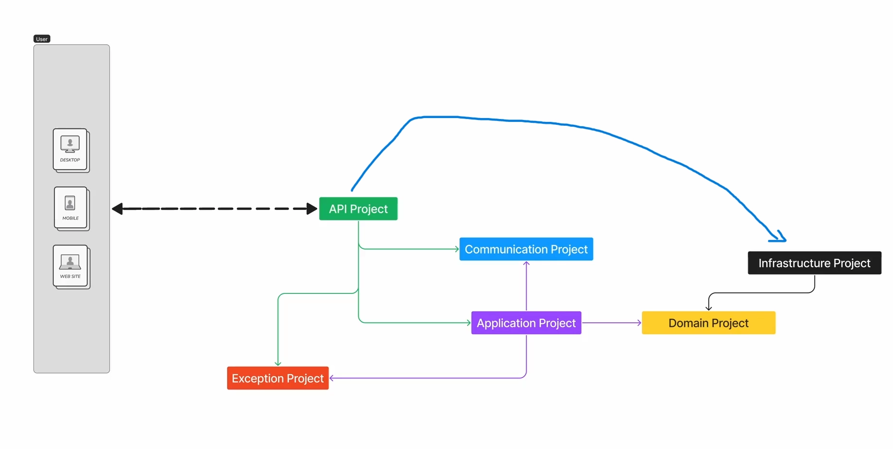

# 🚀 ProvaPratica API

API desenvolvida em **.NET** seguindo os princípios do **SOLID** e utilizando **DDD (Domain-Driven Design)** como padrão arquitetural.

O projeto está containerizado com **Docker** e pode ser executado tanto via **Docker Compose** quanto diretamente pelo **Visual Studio**.

---

## 🏗️ Arquitetura do Projeto

O projeto segue o padrão **DDD**, organizado em camadas bem definidas:

- **Domain** → Entidades, Interfaces de Repositórios, Regras de Negócio
- **Application** → Casos de uso (UseCases), DTOs, Regras de aplicação
- **Infrastructure** → Acesso a dados, Repositórios, Configurações externas
- **API** → Controllers, Middlewares, Filtros

As camadas **Application** e **Infrastructure** possuem classes específicas para **Injeção de Dependência**, facilitando organização e desacoplamento.

Exemplo:

```csharp
builder.Services
    .AddApplication()
    .AddInfrastructure(configuration);
```

---

## 🖼️ Diagrama



(Insira aqui a imagem do diagrama explicando as camadas)

---

# 🐳 Rodando com Docker

O projeto possui `docker-compose.yml` configurado com **build automático da aplicação**.

### ✅ Pré-requisitos

- Docker Desktop instalado
- Docker Compose habilitado

---

### ▶️ Subindo a aplicação

Na raiz do projeto, execute:

```bash
docker-compose up --build
```

Ou em segundo plano:

```bash
docker-compose up -d --build
```

---

### 🌐 Acessando a aplicação

Após subir os containers, a API estará disponível em:

```
http://localhost:5000
```

Se estiver utilizando Swagger:

```
http://localhost:5000/swagger
```

---

# 💻 Rodando pelo Visual Studio

Caso prefira rodar diretamente pelo Visual Studio:

1. Abra a solução
2. Defina o projeto **API** como Startup Project
3. Execute com `F5` ou `Ctrl + F5`

A aplicação também estará disponível em:

```
http://localhost:5000
```

---

# 🗄️ Migrations

## ✅ Execução automática

As migrations são aplicadas automaticamente ao iniciar o projeto.

---

## 🔧 Executando migration manualmente (caso necessário)

Caso precise gerar ou aplicar migrations manualmente:

### Criar uma nova migration

```bash
dotnet ef migrations add NomeDaMigration \
--project src/ProvaPratica.Infrastructure \
--startup-project src/ProvaPratica.Api
```

### Aplicar migration no banco

```bash
dotnet ef database update \
--project src/ProvaPratica.Infrastructure \
--startup-project src/ProvaPratica.Api
```

---


# 🧱 Princípios Aplicados

- ✅ SOLID
- ✅ DDD
- ✅ Separação de responsabilidades
- ✅ Inversão de dependência
- ✅ Clean Architecture concepts

---

# 📦 Tecnologias Utilizadas

- .NET 8
- Entity Framework Core
- PostgreSQL / MySQL (dependendo da configuração)
- Docker
- Swagger

---

# 👨‍💻 Autor

Daniel Lima
Desenvolvedor Full Stack
